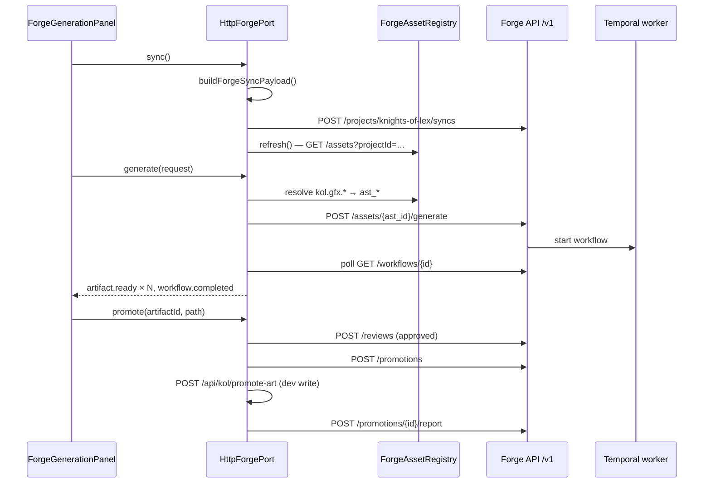

# Zencode Forge integration — Knights of Lex

Consumer guide for integrating this product with **Zencode Forge** (control plane + Temporal workers). Read this before touching `apps/web/src/forge/` or `tools/forge/`.

**Canonical Forge spec (external):** `E:\Projects\Zencode Forge\docs\design\FORGE_IMPLEMENTATION_SPEC.md`  
**Kol implementation entrypoint:** `tools/forge/README.md`  
**Product project id:** `knights-of-lex`

---

## What this integration does

Knights of Lex registers gfx, SFX, and music slots with Forge, generates candidates through Forge workflows, previews them in a dev panel, and promotes approved artifacts into `content/`.

| Phase | Responsibility | Kol owner |
|---|---|---|
| Catalogue | Declare logical keys, recipes, profiles, promotion paths | `buildForgeSyncPayload.ts` |
| Sync | Upsert specs into Forge DB | `HttpForgePort.sync()` |
| Generate | Run Forge workflow (`IsolatedObjectWorkflow`, `AudioGenerationWorkflow`, …) | `HttpForgePort.generate()` |
| Preview | Poll workflow → show artifact blobs | `forgeWorkflowStream.ts` |
| Review + promote | Approve artifact, write file, report hash | `HttpForgePort.promote()` |

**Non-goals (do not reintroduce):**

- `POST /visual/jobs` — bypasses asset specs and review lifecycle
- Client-side transparency hacks (`background: transparent` on `gpt-image-2`, matte removal in Kol)
- Using logical keys (`kol.gfx.*`) directly in `/assets/{id}/generate` — Forge expects `ast_*` spec ids

---

## Prerequisites

### Services

| Service | Default URL | Purpose |
|---|---|---|
| Forge API | `http://127.0.0.1:8080` | REST `/v1/*` |
| Temporal worker | (started with Forge stack) | Runs generation workflows |
| Kol dev server | `http://localhost:5180` | Proxies Forge + dev promote endpoint |

Start Forge from the Zencode Forge repo:

```powershell
cd E:\Projects\Zencode Forge
$env:DOCKER_BUILDKIT=1
docker compose -f deploy/compose/docker-compose.yml --profile ui up -d
# wait until http://127.0.0.1:8080/healthz is OK
```

Avoid `up --build` unless the Forge Dockerfile/deps changed — rebuilds the ~430MB Python image. Prefer leaving the stack running between sessions.

```text
GET  /api/forge-healthz  →  Forge GET /healthz
/api/forge/*             →  Forge /v1/*
```

See `apps/web/vite.config.ts` (`server.proxy`).

### Auth

| Variable | Default | Header |
|---|---|---|
| `VITE_FORGE_TOKEN` | `forge-dev-token` | `Authorization: Bearer …` |

All Forge calls from the browser go through `apps/web/src/forge/forgeApi.ts`.

### Proof commands

```bash
pnpm dev              # Kol + Forge panel
pnpm test:unit        # ForgePromptStore, forgeProviderPolicy, GfxForgeCatalog
pnpm e2e              # media-forge.spec.ts (skips when Forge offline)
```

---

## Architecture



**Boundary rule:** Phaser and `packages/sim` never call Forge. Only `apps/web/src/forge/` and the injected `ForgePort` touch HTTP.

---

## Identifier conventions

Two id spaces — confusing them causes `404 Asset not found`.

| Kind | Example | Used where |
|---|---|---|
| **Logical key** | `kol.gfx.items.militia_sword` | Kol catalogue, `ForgeGenerateRequest.assetId`, sync `assets[].logicalKey` |
| **Forge spec id** | `ast_abc123` | `POST /assets/{id}/generate`, reviews, promotions |
| **Artifact id** | `art_xyz789` | Preview, promote, `metadata` on variants |
| **Workflow id** | `wfr_…` | Poll `GET /workflows/{id}`; returned as `executionId` |

### Logical key rules

| Media | Pattern | Example |
|---|---|---|
| Gfx | `kol.gfx.` + artKey with `/` → `.` | `items/militia_sword` → `kol.gfx.items.militia_sword` |
| SFX | `kol.sfx.` + sound id from `content/audio/sounds.json` | `kol.sfx.item_equip` |
| Music | `kol.music.` + slot key from `content/audio/music.json` | `kol.music.zedwood_overland` |

Helper: `gfxForgeAssetId(artKey)` in `apps/web/src/gfx/GfxForgeCatalog.ts`.

### Kol recipe id vs Forge recipe ref

The panel uses **Kol recipe ids** (`kol.item-icon.v1`, …) for UI and provider policy. Sync maps them to **Forge recipe refs** on each asset spec:

| Kol recipe (`ForgeRecipeId`) | Forge `recipe` | Forge `assetType` |
|---|---|---|
| `kol.item-icon.v1`, portraits, UI, hex, logo | `isolated-object-2d.v1` | `isolated-object-2d` |
| `kol.sfx.v1` | `sfx.v1` | `sfx` |
| `kol.music.v1` | `music-cue.v1` | `music-cue` |

Mapping: `apps/web/src/forge/forgeRecipeMapping.ts`.

### Promotion paths

Written under `repository.allowedWriteRoots` in `tools/forge/project.yaml`:

| Media | `metadata.path` pattern |
|---|---|
| Images | `content/images/{artKey}.png` |
| SFX | `content/sounds/{category}/{fileKey}.ogg` |
| Music | path from `content/audio/music.json` slots |

### Composite sheet sizing

Composite-sheet assets (`assetType: composite-sheet`, recipe `composite-sheet.v1`) carry **two sizes**. Never assume `cols × cellWidth` is what gpt-image-2 receives.

| Role | Primary buttons example | Authoritative fields |
|---|---|---|
| **Catalogue / in-game** | 320×112 sheet, 160×56 cells | `requirements.compositeSheet` (`rows`, `cols`, `cellWidth`, `cellHeight`, `cells`); `metadata.targetWidth` / `targetHeight` |
| **Provider generation** | 1392×496 (gpt-image-2 min pixels for that ratio) | `requirements.width` / `requirements.height` |

Kol computes provider dimensions in `apps/web/src/forge/forgeGenerationSize.ts` (`resolveForgeGenerationDimensions`) so generation preserves catalogue aspect while satisfying gpt-image-2 limits, preferring canonical sizes (1024², 1024×2048, …) when they fit. Scene surfaces catalogue at **1024×2048** (portrait 1:2 for the mobile shell). Forge `prepare_generation` must pass those `requirements.width` / `height` values as the composite workflow `outputContract`.

**Do not** use isolated-object `derivatives` (square max-edge thumbnails) for composite cell downscale. Cell fit uses layout `cellWidth` × `cellHeight` after slice when generation size exceeds the catalogue sheet.

#### Two promotion paths

| Composite type | Promotion | Cell fit after upscaled generate? |
|---|---|---|
| Button / hex / symbol **slices** | Per-cell PNGs → `content/images/{sliceArtKey}.png` via `metadata.sliceArtKeys` | Yes |
| Item **animation sheets** | Full sheet → `items/*_sheet.png` via `metadata.sheetPromotionArtKey` | No (sheet-level only) |

Catalogue source: `apps/web/src/gfx/GfxCompositeCatalog.ts`. Sync builder: `compositeGfxAssetSpec` in `apps/web/src/forge/forgeAssetSpecs.ts`.

---

## Repository layout

```text
tools/forge/
  project.yaml              # forge.project.v1 manifest (projectId, profiles, write roots)
  profiles/*.json             # forge.profile.v1 — matte, aesthetic, QA thresholds
  adapter/README.md           # CLI sync notes (browser sync is primary)
  README.md                   # Quick index → this document

apps/web/src/forge/
  HttpForgePort.ts            # ForgePort implementation
  buildForgeSyncPayload.ts    # Assembles SyncRequest
  forgeAssetSpecs.ts          # Gfx + audio → forge.asset.v1 documents
  forgeManifest.ts            # Manifest constant (mirrors project.yaml)
  forgeProfiles.ts            # Profile constants (mirrors profiles/*.json)
  forgeRecipeMapping.ts       # Kol recipe → Forge recipe/profile/type
  ForgeAssetRegistry.ts       # logicalKey → ast_* cache
  forgeWorkflowStream.ts      # Poll workflows → panel events
  forgeApi.ts                 # fetch helpers, auth
  ForgeGenerationPanel.ts     # Dev UI (left margin)
  ForgePromptStore.ts         # localStorage drafts → merged on sync
  createForgePort.ts          # Always HttpForgePort (no stub in prod path)

apps/web/src/ports/ForgePort.ts   # Interface consumed by panel / test harness
apps/web/vite.kolPromotePlugin.ts # Dev-only POST /api/kol/promote-art
```

**Dual source of truth for profiles:** `tools/forge/profiles/*.json` (CLI / disk sync) and `forgeProfiles.ts` (browser sync). Keep them aligned when editing profiles.

**Asset specs on disk:** Not checked in per slot (hundreds of gfx entries). Built at runtime from `GfxForgeCatalog` + audio manifests. Optional future: `pnpm forge:emit-specs` → `tools/forge/assets/*.json` for CLI-only sync.

---

## API lifecycle (step by step)

Base URL in dev: `/api/forge` (rewrites to Forge `/v1`).

### 1. Sync

**When:** Automatically via `HttpForgePort.ensureSynced()` when:
- The Forge panel loads and Forge is online
- **Generate** is clicked (catalogue/registry stale or prompt drafts changed)
- A required `logicalKey` is missing from the Forge registry

Manual **Sync Specs** still forces a full sync. Fingerprinting (`forgeSyncFingerprint.ts`) skips redundant syncs when nothing changed. The last successful fingerprint is stored in `sessionStorage` (`kol-forge-sync-fp:v1`) so a page reload does not re-POST the full catalogue. Panel boot runs sync in the background after marking Forge online.

**Request:** `POST /projects/knights-of-lex/syncs`

```json
{
  "repositoryRevision": "web-dev",
  "adapterVersion": "1",
  "manifestHash": "sha256:…",
  "manifest": { "schemaVersion": "forge.project.v1", "projectId": "knights-of-lex", "…": "…" },
  "profiles": [ { "schemaVersion": "forge.profile.v1", "profileKey": "knights-of-lex.item-icon.v1", "…": "…" } ],
  "assets": [
    {
      "schemaVersion": "forge.asset.v1",
      "projectId": "knights-of-lex",
      "logicalKey": "kol.gfx.items.militia_sword",
      "assetType": "isolated-object-2d",
      "recipe": "isolated-object-2d.v1",
      "profile": "knights-of-lex.item-icon.v1",
      "requirements": { "width": 128, "height": 128, "alpha": true, "variantCount": 4 },
      "metadata": {
        "brief": "Item icon of a simple militia shortsword, centered, soft rim light, cozy SNES fantasy",
        "path": "content/images/items/militia_sword.png",
        "artKey": "items/militia_sword",
        "kolRecipeId": "kol.item-icon.v1"
      },
      "consumer": { "kind": "gfx", "id": "items/militia_sword", "field": "image" }
    }
  ]
}
```

**After sync:** `GET /assets?projectId=knights-of-lex&limit=500` → cache `logicalKey` → `id`.

**Prompt drafts:** Keys in `localStorage` (`kol-forge-prompts:v2:{artKey}`) are merged into `metadata.brief` for gfx logical keys on sync (`ForgePromptStore.loadAllForgePromptBriefs`).

### 2. Generate

**Request:** `POST /assets/{ast_id}/generate`

```json
{
  "provider": "openai-image",
  "model": "gpt-image-2",
  "requestedBy": "knights-of-lex-web",
  "lane": "interactive",
  "idempotencyKey": "ast_…:openai-image:gpt-image-2:173…"
}
```

Generation prompt comes from the synced asset spec (`metadata.brief`) and profile — **not** from extra fields in this body. Size, recipe, variant count, and alpha also come from the synced spec. The Kol panel only chooses **provider** and **model** for this call (plus local prompt drafts that sync into `metadata.brief`).

**Response:** `WorkflowOut` — use `id` as `executionId`.

**Provider policy (images):** `openai-image` / `gpt-image-2` only (`forgeProviderPolicy.ts`).

### 3. Stream / poll (panel events)

Kol does **not** use `GET /v1/events/stream` today. `forgeWorkflowStream.ts` polls:

`GET /workflows/{workflow_id}` every 1.5s until terminal state.

| `businessState` | Panel behaviour |
|---|---|
| `awaiting_review` | Emit `artifact.ready` for each id in `result.artifactIds` (or snake_case variants), then `workflow.completed` |
| `completed` | Same |
| `failed_*` / `cancelled` | Throw with `lastErrorCode` |

Synthetic events (stable contract for `ForgeGenerationPanel`):

```json
{ "event": "artifact.ready", "data": { "artifactId": "art_…", "batchIndex": 0, "destinationPath": "content/images/…", "mediaKind": "image" } }
{ "event": "workflow.completed", "data": { "executionId": "wfr_…" } }
```

**Preview:** `GET /artifacts/{artifact_id}/content` → blob URL (not `/visual/assets/…`).

### 4. Promote

Order is fixed — skipping review fails with lifecycle errors.

1. `POST /reviews` — `{ projectId, assetSpecId, artifactId, decision: "approved", reviewerId }`
2. `POST /promotions` — `{ projectId, assetSpecId, artifactId, destination: { relativePath } }`
3. Dev: `POST /api/kol/promote-art` — write bytes to repo `content/` (see `vite.kolPromotePlugin.ts`)
4. `POST /promotions/{id}/report` — agent report with `writtenHashes`

Production agents can use Forge `POST /promotions/{id}/execute-local` when the product tree is mounted on the Forge host; Kol dev uses the Vite promote plugin instead.

---

## Transparency and alpha

**Forge owns transparency.** Kol sets `requirements.alpha: true` on specs and uses profiles with `matteProfile` (v9 chroma key) for sprites. Kol does **not**:

- Pass `background: transparent` to OpenAI for `gpt-image-2`
- Run matte removal or opaque retries client-side

Profile example: `tools/forge/profiles/knights-of-lex.item-icon.v1.json`.

If transparent jobs fail instantly, the Forge API likely needs the Scrapfall v9 matte path for `gpt-image-2` — restart Forge workers after updating `visual_routes.py` in the Forge repo.

---

## Adding a new asset slot

### Gfx (image)

1. Register `artKey` in `apps/web/src/gfx/VisualRegistry.ts` (or existing registry helper).
2. `listGfxForgeEntries()` picks it up via `GfxForgeCatalog` — infer family/recipe/dimensions automatically.
3. **Sync** → **Generate** in panel.
4. Promote writes `content/images/{artKey}.png`.

### SFX

1. Add entry to `content/audio/sounds.json`.
2. Re-sync — `forgeAssetSpecs.ts` emits `kol.sfx.{id}`.
3. Generate with recipe `kol.sfx.v1`.

### Music

1. Add slot to `content/audio/music.json`.
2. Re-sync — logical key `kol.music.{key}`.

### New profile or recipe family

1. Add `tools/forge/profiles/{profileKey}.json`.
2. Mirror in `forgeProfiles.ts` and `project.yaml` `profiles:` map.
3. Extend `profileForRecipe()` / `forgeRecipeMapping.ts` if needed.

---

## Implementing `ForgePort` in another host

Minimum surface (`apps/web/src/ports/ForgePort.ts`):

```typescript
interface ForgePort {
  health(): Promise<boolean>;
  sync(): Promise<void>;
  ensureSynced(requiredLogicalKey?: string): Promise<boolean>;
  listProviders(): Promise<readonly ForgeProviderInfo[]>;
  generate(request: ForgeGenerateRequest): Promise<ForgeGenerateResult>;
  streamEvents(executionId, onEvent, signal?): Promise<void>;
  getArtifactPreviewUrl(artifactId: string): Promise<string | null>;
  promote(artifactId: string, destinationPath: string): Promise<void>;
}
```

Copy or depend on:

- `buildForgeSyncPayload` + `ForgeAssetRegistry` for sync/id resolution
- `pollWorkflowEvents` for progress
- Review → promotion → local write → report for promote

Wire at composition root (`BootOrchestrator`), not inside Phaser scenes.

---

## Troubleshooting

| Symptom | Likely cause | Fix |
|---|---|---|
| `404 Asset not found` on generate | Logical key used instead of `ast_*`, or never synced | Run **Sync**; check `GET /assets?projectId=knights-of-lex` |
| `generation_failed` in &lt;1s, transparent + 4 variants | Forge sending `background: transparent` to `gpt-image-2` | Update + restart Forge API (matte v9 path) |
| Variant grid stays empty | Workflow failed or poll timeout | Check panel log; `GET /workflows/{id}` `lastErrorCode` and `result.error_message` |
| `missing cell_artifact_ids` on composite | Usually a **failed** workflow misread as success (fixed in Kol poll order) or Forge worker/API older than composite-sheet finalize | Read `result.error_message`; rebuild/restart Forge workers if success lacks `cell_artifact_ids` |
| `Unknown image provider: openai-image` | Forge **worker** missing `FORGE_OPENAI_API_KEY` / `OPENAI_API_KEY` at startup | Set key in `deploy/compose/.env`, restart **forge-worker** (not just API). Check `GET /healthz` → `imageGenerationReady: true`. |
| Promote: `review_pending` / lifecycle error | Review skipped or wrong artifact | Generate first; promote only artifacts from latest workflow result |
| `Asset not found` in audio e2e | Forge offline or sync skipped | Start Forge; harness calls `sync()` before generate |
| `403 CSRF validation failed` on sync/generate | Browser sent Forge workbench session cookies with Bearer requests | Kol uses `credentials: 'omit'` on Forge fetches — hard-refresh after update |
| CORS / network errors | Forge not running or wrong proxy port | Confirm `:8080` and `vite.config.ts` proxy |

---

## Related documents

| Document | Topic |
|---|---|
| [tools/forge/README.md](../../tools/forge/README.md) | In-repo quick reference |
| [tools/forge/adapter/README.md](../../tools/forge/adapter/README.md) | CLI / disk adapter |
| [content-pipeline.md](../architecture/content-pipeline.md) | Art boundary rules |
| [sources.md](../sources.md) | External Forge spec paths |
| [phaser-4-host-patterns.md](../engines/phaser-4-host-patterns.md) | Media ports in Phaser host |
