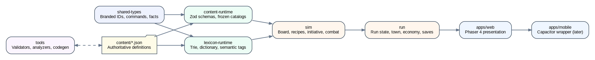
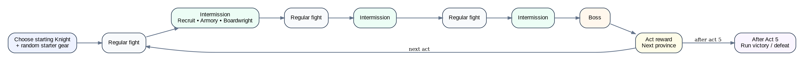
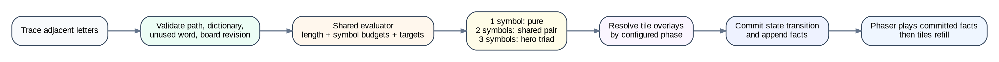
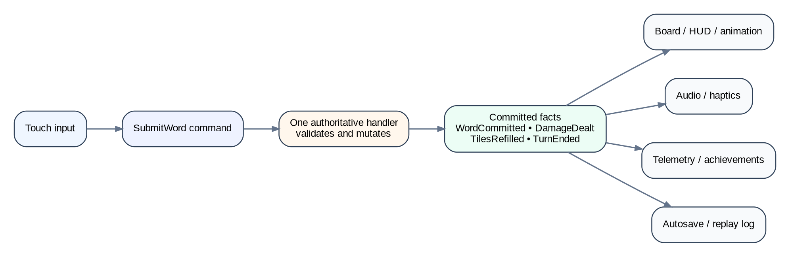

# Knights of Lex
## Game Design and Implementation Guide

**Version:** 0.1 — foundation lock  
**Product:** browser-first, mobile-shaped 2D word RPG / run-based roguelite  
**Host:** Phaser 4 + TypeScript  
**Setting:** the Kingdom of Lex  
**Domain:** `knightsoflex.com`  
**Status vocabulary:**

- **LOCKED** — foundational rule; changing it requires an ADR and matching tests/validators.
- **PROVISIONAL** — initial implementation baseline; expected to move through simulation and playtesting.
- **DEFERRED** — intentionally outside the first implementation, but the architecture must not prevent it.

---

# 1. Product thesis

Knights of Lex is a party-based fantasy RPG in which each hero owns a persistent hex word board. Combat proceeds through an initiative order. When a hero’s turn arrives, the player traces one valid adjacent-letter word on that hero’s board. The letters establish the word and its length; the symbols carried by those tiles determine the combat action.

The game’s defining grammar is:

> **Words provide power. Symbols form an action. The hero’s three-symbol vocabulary determines the available pure, paired, and signature moves.**

A submitted word consumes exactly one hero turn. Longer words are valuable because they produce more symbol power, receive a universal length bonus, and still cost only one turn. Hero abilities, semantic affinities, equipment, board objects, enemy interference, and path geometry create additional reasons to prefer one valid word over another.

The product should feel like a proper mobile RPG rather than a score-chasing word game:

- individual heroes with health, equipment, levels, and skill trees;
- a three-hero party with front/back formation;
- deterministic initiative combat with enemy intents;
- run-scoped recruitment, gear, board modifications, and ability builds;
- five acts, each consisting of three regular encounters and a boss;
- full recovery between fights, so the run is about build quality and combat decisions rather than attrition bookkeeping;
- mostly horizontal permanent progression between runs.

The first client is a mobile-shaped Phaser web build. A thin Capacitor shell may later package the same client for Android and iOS.

---

# 2. North-star architecture rule

> **Preview, submission validation, combat settlement, replay facts, telemetry, and saving all consume the same domain evaluation.**

Phaser displays state and forwards commands. It never calculates authoritative damage, healing, targeting, rewards, legality, initiative, word acceptance, or random results.



---

# 3. Locked product contracts

## 3.1 Meta contracts

**M1 — One word, one turn.** Submitting any valid word consumes the current hero’s full turn, regardless of word length.

**M2 — Initiative selects the actor.** The player does not freely choose which hero acts. Only the living unit currently at the front of the initiative queue may take a turn.

**M3 — One active hero board.** Only the current hero’s board may commit a word. Other hero boards may be inspected, but cannot be played out of turn.

**M4 — No manual combat targeting.** Targeting is inherent in pure actions, pair recipes, triad recipes, abilities, and board objects. A word is traced and released; it is never dragged onto a target.

**M5 — Separate hero state.** Every hero has an independent health bar, Shield pool, statuses, level, XP, equipment, skill choices, board, and downed state.

**M6 — Party defeat.** A downed hero cannot act or use their board. The battle ends in defeat only when every active hero is downed.

**M7 — Formation is pre-combat.** The player assigns active heroes to front or back formation before the fight. Formation cannot be freely changed during combat; only explicit effects may move units.

**M8 — Persistent battle boards.** A hero’s board persists across their turns within a battle. Only consumed tiles reroll. A fresh board is generated for each new battle.

**M9 — No repeated word in one battle.** Once a normalized word has been committed in a battle, that word cannot be submitted again in that battle, even if the letters reappear.

**M10 — Full inter-fight recovery.** All heroes fully heal and revive between fights. Temporary Shield and battle statuses clear.

**M11 — Three active heroes.** The first product version supports a maximum active party of three. Reserve and replacement systems are deferred.

**M12 — Run-scoped power.** Levels, skill choices, recruited party, equipment, board modifications, gold, consumables, and current boards reset when a run ends.

**M13 — Breadth-first permanent progression.** Permanent progression unlocks heroes, item families, board modifications, ability choices, acts, challenge modes, cosmetics, and codex knowledge. It does not provide uncapped account-wide statistical escalation.

## 3.2 Architecture contracts

**A1 — Host-free authority.** The simulation, run, content, and lexicon packages import no Phaser, DOM, browser storage, wall-clock, network, or platform SDK APIs.

**A2 — Presentation is a bridge.** Phaser sends commands and plays committed facts. It does not mutate domain state directly.

**A3 — Command → one handler → facts.** Every mutation command has exactly one authoritative handler. Successful handlers append committed facts. Observers may react to facts but may not re-emit the same command synchronously.

**A4 — One owner per action primitive.** Every generic effect action has exactly one execution owner and a bidirectional content-to-executor registry check.

**A5 — Content is authoritative JSON.** Heroes, recipes, abilities, items, enemies, encounters, acts, special objects, board modifications, and balance curves are authored in versioned JSON and validated before runtime use.

**A6 — No content-ID branching in the kernel.** The simulation never contains branches such as `if (heroId === 'hero.vanguard')`. Content publishes generic triggers, conditions, modifiers, and effect actions.

**A7 — Named deterministic RNG streams.** Gameplay randomness never uses `Math.random()`. Board generation, refills, initiative, enemy choices, rewards, shops, and recruitment have named streams.

**A8 — Commit before show.** Shop stock, recruitment offers, reward choices, and other economy rolls are committed to run state before the client reveals them.

**A9 — Split content hashes.** Saves and deterministic tests use a gameplay content hash. Art, audio, localization, and cosmetic changes use separate visual hashes and do not invalidate gameplay state.

**A10 — Done means named proof.** Every tranche includes unit proof, boundary proof, validator proof, and human proof where presentation is involved.

## 3.3 Content contracts

**C1 — Five foundational symbols.** The founding combat alphabet is Strike, Shot, Spark, Guard, and Heal.

**C2 — Exactly three symbols per founding hero.** Each founding hero has a fixed three-symbol board vocabulary.

**C3 — Exact symbol-set recipe selection.** One distinct symbol selects a pure action. Two distinct symbols select the shared pair recipe. All three select that hero’s unique triad recipe.

**C4 — Recipes replace components.** Pair and triad recipes consume and reinterpret the symbol power vector. They do not fire their component pure actions independently and then add a free signature effect.

**C5 — Automatic targets are deterministic.** Every action has a deterministic target selector. Ties resolve by a stable documented order.

**C6 — One equipment slot per hero symbol.** A three-symbol hero has three equipment slots, each keyed to one symbol in their kit.

**C7 — Three skill trees per hero.** Each hero owns one minor skill tree for each of their three symbols.

**C8 — One level-1 ability.** Every hero begins a run with one defining ability. There is no separate mandatory “word passive” subsystem.

**C9 — Runtime semantic lookup only.** Semantic affinity catalogues are produced offline and reviewed. Runtime only performs deterministic word-to-tag lookup.

---

# 4. Core game loop

## 4.1 Run start

1. The player chooses one unlocked starting Knight.
2. The hero begins at level 1 with their level-1 ability.
3. A small random starter loadout is committed from pools compatible with that hero’s three symbol slots.
4. The player enters Act 1 with one hero. Recruitment opportunities expand the party toward the active cap of three.

## 4.2 Act structure

Each act contains:

1. Regular fight
2. Intermission
3. Regular fight
4. Intermission
5. Regular fight
6. Intermission
7. Boss
8. Act reward and transition

The intended full run has five acts: fifteen regular fights and five bosses. The run is resumable after every committed command and is not expected to be completed in one mobile sitting.



## 4.3 Fight rewards

Regular fights award:

- XP to every active hero, including heroes downed during the fight;
- gold;
- a gear choice or committed gear reward weighted toward symbols represented in the current party.

Bosses award:

- increased XP and gold;
- higher-quality gear choices;
- an act-level reward such as a rare board modification, powerful item, recruitment opportunity, or additional unlock.

Exact quantities and rarity curves are **PROVISIONAL** and live in balance content rather than code.

## 4.4 Intermission

The domain concept is `Intermission`, not `Town`. The first presentation is a town in the Kingdom of Lex with three services:

- **Recruiter:** offers a committed selection of heroes.
- **Armory:** sells and manages symbol-keyed equipment.
- **Boardwright:** sells run-scoped modifications to hero boards.

The intermission service registry must later support camps, shrines, story events, trainers, travelling merchants, treasure rooms, risks, and alternate routes without changing the run state machine.

## 4.5 Recruitment and XP

Heroes technically earn XP independently. To keep a newly recruited hero viable:

- all active heroes receive the encounter’s base XP;
- a recruit enters at the act’s catch-up baseline, normally close to the active party’s average level;
- the catch-up policy is content-driven and may be tuned without changing hero XP ownership.

The initial level cap is 9. The schema and runtime must support at least level 20 without structural changes.

---

# 5. Combat model

## 5.1 Battle phases

```text
PreBattleFormation
  → BattleInitialization
  → InitiativeReady
  → HeroTurnAwaitingWord | EnemyTurnReady
  → ResolutionCommitted
  → PresentationPlayback
  → InitiativeAdvanced
  → Victory | Defeat
```

The domain may internally use finer phases, but presentation must never infer a phase from animation state.

## 5.2 Initiative

Initiative is D&D-like:

- each living unit receives a deterministic initiative result at battle start from unit initiative statistics plus a named seeded roll;
- the initial order is stable and persisted in battle state;
- the queue cycles until battle end;
- Haste, Slow, delay, stun, Overwatch, interrupts, and future abilities manipulate explicit initiative entries or turn eligibility;
- enemies declare or expose their next intent according to their content policy, normally before their turn becomes imminent.

The first implementation should prefer a fixed round order with explicit queue mutations over a continuous-time bar. This is easier to preview, replay, and explain while retaining meaningful initiative mechanics.

## 5.3 Front and back formation

Every unit has a formation rank:

- `front`
- `back`

Target selectors operate on living units:

- `frontmost_enemy` chooses a living front unit if one exists; otherwise the foremost living back unit;
- `rearmost_enemy` chooses a living back unit if one exists; otherwise the rearmost living front unit;
- with one living enemy, it is both frontmost and rearmost;
- allies use equivalent selectors.

This makes “no valid front/rear target” impossible while living units remain.

Enemies obey the same rank restrictions as heroes unless an explicit action says otherwise.

## 5.4 Health, Shield, and downing

**PROVISIONAL baseline:** a level-1 hero begins near 100 HP.

- Damage first consumes eligible Shield, then HP.
- Basic Guard creates temporary Shield on the acting hero.
- Shield expiry is defined by the action or effect. Basic Shield normally lasts until the hero’s next turn begins or until consumed.
- A hero at zero HP becomes downed immediately.
- A downed hero is skipped in initiative and their board becomes non-interactive.
- Full party defeat ends the fight.
- Victory or defeat is committed before presentation ceremony begins.

---

# 6. Hero boards and word rules

## 6.1 Board shape

**PROVISIONAL baseline:** a 37-cell hex board, represented as integer axial coordinates and generated per hero at battle start.

The board shape, letter distribution, solver thresholds, and tile counts are data-driven. Domain coordinates must never use Phaser display positions as truth.

## 6.2 Tile model

Every ordinary tile contains:

```text
Tile
- coord
- letter
- combatSymbol        // one of the hero’s three symbols
- specialObject?      // potion, scroll, chest, trap, corruption, etc.
- stateFlags          // protected, frozen, mutated, revealed, etc.
- revision
```

Every founding hero board uses only the hero’s three symbols. Initial board modifications may change symbol weights but may not introduce a fourth foundational symbol. Adding cross-kit symbols later requires an ADR because it changes the one-triad-per-hero contract.

## 6.3 Path validation

A candidate word is valid when:

- it contains at least the configured minimum number of letters; initial baseline is three;
- every consecutive tile is adjacent in the hex topology;
- no tile is used twice in the same path;
- the normalized letter sequence exists in the accepted runtime lexicon;
- the normalized word has not already been committed in this battle;
- the path belongs to the current initiative hero’s current board revision;
- no tile state explicitly forbids use.

Rejected submissions produce an explicit rejection code and no mutation.

## 6.4 Board persistence and refill

After a successful word:

1. the committed action resolves;
2. configured special objects resolve separately;
3. every used tile rerolls its letter and combat symbol together;
4. unused tiles remain unchanged;
5. the board solver verifies that the resulting board satisfies the configured minimum playability contract;
6. corrective deterministic rerolls occur only through the board authority and are included in committed facts.

A board persists for the entire fight and is regenerated for the next fight.

## 6.5 Dead-board prevention

The lexicon runtime maintains a trie or equivalent prefix structure capable of enumerating valid paths on a board. Board generation and refill validation must be deterministic and fast enough to run synchronously for the initial board size.

The minimum contract is not merely “one obscure legal word exists.” The board-quality evaluator should expose metrics such as:

- total valid words;
- number of familiar words;
- longest available word;
- number of words at each length;
- symbol-set coverage;
- current hero affinity opportunities;
- path bottlenecks.

Only the hard no-word rule blocks the first implementation. Quality thresholds are **PROVISIONAL** and should be studied through tooling and telemetry.

---

# 7. Word evaluation and committed resolution



## 7.1 Power vector

The evaluator converts the traced word into a five-axis `SymbolPowerVector`:

```ts
interface SymbolPowerVector {
  strike: number;
  shot: number;
  spark: number;
  guard: number;
  heal: number;
}
```

For the current hero, only three axes can be non-zero.

**PROVISIONAL baseline:** each Strike or Guard symbol contributes approximately 10 base units before word-length, item, stat, and ability modifiers. Other symbols use comparable initial units with action-specific efficiency. Spark is intentionally weaker per target because it affects all living enemies.

The calculation shape is:

```text
symbol units
  = symbol count
  × hero symbol coefficient
  × equipment/stat modifiers

word power vector
  = symbol units
  × universal length curve

resolved action
  = recipe transforms vector
  → abilities and item hooks modify plan
  → deterministic target selectors bind targets
  → effect executor commits results
```

The universal length curve is authored in balance content. It must be monotonic and must make a long word meaningfully stronger than a short word even before hero-specific abilities. The exact curve is not a contract.

## 7.2 Exact recipe selection

Let `distinctSymbols` be the set of foundational symbols present in the word.

- one distinct symbol → pure action;
- two distinct symbols → shared pair recipe;
- all three hero symbols → that hero’s unique triad recipe.

Counts affect power, not recipe identity. `Strike ×4 + Heal ×1` and `Strike ×1 + Heal ×4` are both Vampiric Strike, but produce differently weighted outcomes.

Pair and triad recipes replace the component actions. They consume the same budget and cannot simply grant every pure action at full value plus bonus utility.

## 7.3 Shared evaluation object

`EvaluateWord` is a pure domain service returning a complete, immutable `WordEvaluation`:

```ts
interface WordEvaluation {
  boardRevision: number;
  normalizedWord: string;
  path: readonly HexCoord[];
  symbolCounts: SymbolCounts;
  distinctSymbolKey: SymbolSetKey;
  recipeId: RecipeId;
  lengthScalar: number;
  semanticTags: readonly SemanticTagId[];
  effectPlan: readonly PlannedEffect[];
  specialObjectPlans: readonly PlannedSpecialEffect[];
  projectedFacts: readonly ProjectedFact[];
  evaluationDigest: string;
}
```

The same evaluator powers trace preview and command settlement. On release, `SubmitWordHandler` revalidates against the current board revision, computes the evaluation once, mutates state from that evaluation, and includes its digest and resolved values in committed facts.

Presentation never recomputes results from the word.

---

# 8. Foundational symbol language

## 8.1 Pure actions

| Symbol | Pure action | Automatic result |
|---|---|---|
| **Strike** | Strike | Deal physical damage to the frontmost living enemy. |
| **Shot** | Shot | Deal physical damage to the rearmost living enemy. |
| **Spark** | Spark | Deal reduced magical damage to every living enemy. |
| **Guard** | Guard | Give temporary Shield to the acting hero. |
| **Heal** | Heal | Restore HP to the living ally with the lowest health percentage. |

Stable ties resolve by formation rank, then initiative order, then branded unit ID.

## 8.2 Shared pair recipes

The pair language is global. Once learned, it behaves consistently on every hero who owns that pair. Hero abilities and items may modify it without changing its fundamental promise.

| Symbols | Pair move | Base combat contract |
|---|---|---|
| Strike + Shot | **Force Strike** | Project the force of a melee blow into the rearmost enemy. All physical budget becomes one heavy ranged impact. |
| Strike + Spark | **Smite** | Deliver a hybrid physical/magical blow to the frontmost enemy, with improved performance against Shield, armour, or magical protection. |
| Strike + Guard | **Shield Slam** | Create Shield, then use part of the defensive budget to strike the frontmost enemy. Strong results may delay that enemy. |
| Strike + Heal | **Vampiric Strike** | Damage the frontmost enemy and heal the party from actual HP removed, not attempted damage. |
| Shot + Spark | **Chain Shot** | Strike the rearmost enemy, then arc forward through other living enemies with diminishing magical damage. |
| Shot + Guard | **Overwatch** | Gain Shield and prepare a reaction shot that resolves immediately before the next eligible enemy action. |
| Shot + Heal | **Healing Volley** | Convert the whole action into immediate healing distributed across every living party member. |
| Spark + Guard | **Electric Field** | Create a Barrier around the acting hero that retaliates with Spark damage when attacked. |
| Spark + Heal | **Regeneration** | Apply healing over time to the whole living party. It offers more total recovery than Healing Volley, but delayed. |
| Guard + Heal | **Sanctuary** | Heal the most injured living ally; excess healing converts into Shield on that ally. |

All values, conversion ratios, trigger limits, and durations are content-driven.

---

# 9. Founding hero matrix

The five symbols produce exactly ten unique three-symbol combinations. The founding roster gives each triad to one hero.

| Hero | Symbols | Unique triad | Level-1 ability |
|---|---|---|---|
| Corsair | Strike · Shot · Spark | Broadside | Full Salvo |
| Skirmisher | Strike · Shot · Guard | Hit and Run | Footwork |
| Valkyrie | Strike · Shot · Heal | Rescue Charge | Battle Mercy |
| Spellblade | Strike · Spark · Guard | Arcane Riposte | Spellweave |
| Paladin | Strike · Spark · Heal | Radiant Judgment | Lay on Hands |
| Vanguard | Strike · Guard · Heal | Last Bastion | Hold Fast |
| Spellbow | Shot · Spark · Guard | Tempest Screen | Runic Draw |
| Druid | Shot · Spark · Heal | Verdant Storm | Deep Roots |
| Ranger | Shot · Guard · Heal | Rescue Volley | Longbow |
| Cleric | Spark · Guard · Heal | Purifying Light | Mercy |

Class names and flavour remain content-level names, but the symbol ownership matrix is **LOCKED** for the founding roster.

## 9.1 Corsair

**Triad — Broadside:** Resolve a formation-wide salvo. Power is divided into successive strikes across living enemies; unused salvos converge on the strongest survivor or single boss.

**Level 1 — Full Salvo:** A sufficiently long word adds an additional Broadside strike. The triggering threshold and added power are tunable.

## 9.2 Skirmisher

**Triad — Hit and Run:** Damage frontmost and rearmost enemies, then gain Dodge instead of ordinary Shield. Dodge negates the next eligible direct attack.

**Level 1 — Footwork:** Direction changes in the traced path add a capped defensive bonus. Winding words become valuable without replacing the universal length incentive.

## 9.3 Valkyrie

**Triad — Rescue Charge:** Damage frontmost and rearmost enemies, then heal the whole party from actual physical damage dealt. The weakest ally receives the largest share.

**Level 1 — Battle Mercy:** Damaging multiple distinct enemies in one action improves healing conversion. A single-target baseline remains so the ability is not dead against bosses.

## 9.4 Spellblade

**Triad — Arcane Riposte:** Strike the frontmost enemy, create a Barrier, and retaliate with hybrid damage when eligible enemy attacks are absorbed by that Barrier.

**Level 1 — Spellweave:** When Strike and Spark symbol counts are close to balanced, both portions receive a power bonus.

## 9.5 Paladin

**Triad — Radiant Judgment:** Deliver a hybrid front-line judgment whose resolved damage generates party healing. Healing beyond missing party HP becomes radiant damage without recursive conversion.

**Level 1 — Lay on Hands:** Whenever a Paladin action heals the most injured ally, that ally also receives a small Barrier.

## 9.6 Vanguard

**Triad — Last Bastion:** Protect the party, heal the weakest ally, and prepare a retaliatory Strike based on Shield consumed during the next eligible enemy sequence.

**Level 1 — Hold Fast:**

- generate Shield from the word’s letter count;
- double that generated Shield for a seven-letter-or-longer word;
- double it again when the submitted word has the reviewed `guard_word` semantic tag;
- both multipliers stack.

This is intentionally capable of producing exceptional overshield moments. A later Vanguard skill, **Shield Bash**, converts a percentage of Shield generated by the current word into immediate damage.

## 9.7 Spellbow

**Triad — Tempest Screen:** Fire a Chain Shot through the enemy formation and create a screen that intercepts the next eligible ranged or magical enemy action, reflecting part of its power.

**Level 1 — Runic Draw:** Rare letters increase Spark output and screen strength. The rare-letter catalogue is deterministic content.

## 9.8 Druid

**Triad — Verdant Storm:** Damage the enemy formation, apply Regeneration to the living party, and Root or delay the rearmost enemy.

**Level 1 — Deep Roots:** Distinct vowels increase Regeneration duration up to a cap.

## 9.9 Ranger

**Triad — Rescue Volley:** Heal the party and establish Overwatch against the next enemy that threatens the most injured ally. A sufficiently strong reaction may delay that enemy.

**Level 1 — Longbow:** Shot power increases with the hex distance between the first and final tile in the word path.

## 9.10 Cleric

**Triad — Purifying Light:** Damage the enemy formation, heal and protect the party, and remove the highest-priority removable harmful status. When no status is removable, the cleansing budget converts into additional healing and Shield.

**Level 1 — Mercy:** Healing becomes more efficient as the recipient’s health percentage falls.

## 9.11 Roster balance rule

Triads and level-1 abilities are **PROVISIONAL content**, not architectural exceptions. They must be represented through generic triggers, selectors, conversions, statuses, and effect actions. The balance target is not identical outcomes; it is comparable expected contribution over many boards and encounters, with intentionally different variance profiles.

---

# 10. Hero levels and symbol skill trees

## 10.1 Level model

- Heroes begin at level 1 with their defining level-1 ability.
- Levels are earned independently through XP.
- The initial cap is 9.
- Levels 2–9 grant one skill point each.
- Level cap, XP curve, point awards, prerequisites, and node tiers are content data.
- Runtime collections and save schemas must not assume nine levels or a fixed number of nodes; expansion toward level 20 should require content additions, not a rewrite.

## 10.2 Three trees per hero

Every hero has one tree per owned symbol. For Vanguard:

- Strike tree
- Guard tree
- Heal tree

A tree node may:

- improve the pure action for that symbol;
- modify one or more pair recipes containing that symbol;
- modify the hero’s triad;
- alter a level-1 ability;
- add a deterministic word or path condition;
- change a status, target selector, conversion, or timing rule;
- alter board symbol weights through a declared board modifier.

Avoid trees filled with only small percentage increases. Statistical nodes are allowed, but each branch should include behaviour-changing nodes.

## 10.3 Permanence

Skill choices are permanent for the run. A rare intermission event or content-defined service may permit a partial or full respec. Ordinary town services do not.

---

# 11. Symbol-based equipment

## 11.1 Slot contract

A hero has one equipment slot for each symbol in their kit. Vanguard owns Strike, Guard, and Heal slots; Ranger owns Shot, Guard, and Heal slots.

Items are portable among any heroes who own their slot symbol.

| Slot symbol | Common fantasy forms |
|---|---|
| Strike | sword, axe, spear, gauntlet, hammer |
| Shot | bow, crossbow, sling, firearm, thrown weapon |
| Spark | staff, wand, rune, focus, enchanted implement |
| Guard | shield, armour, cloak, defensive charm |
| Heal | relic, herb kit, sacred text, restorative charm |

The slot is a mechanical category, not a strict anatomical slot.

## 11.2 Item anatomy

Every item can contain:

1. **Core statistics** required to keep pace with harder enemies.
2. **Secondary statistics** for build differentiation.
3. **Recipe or symbol modifiers** that alter how the slot’s actions behave.
4. **Rare signature modifiers** that change a triad, ability, path preference, or board rule.

Gear must provide reliable vertical progression. Behavioural effects supplement rather than replace stat growth.

```ts
interface ItemDefinition {
  id: ItemId;
  schemaVersion: string;
  slotSymbol: FoundationalSymbol;
  rarity: RarityId;
  statModifiers: readonly StatModifierDefinition[];
  hooks: readonly EffectHookDefinition[];
  tags: readonly ItemTagId[];
  artKey: ArtKey;
}
```

## 11.3 Starter equipment

Each starting hero has a curated starter pool. Run creation commits a small random compatible loadout before reveal. Exact item count and whether every slot starts filled are tunable; the system supports both.

## 11.4 Inventory authority

The run package owns inventory, wallet, purchases, sales, and equipment mutation. Presentation cannot apply item stats directly. Every equip, buy, sell, and reward command validates ownership, compatibility, gold, revision, and slot state.

---

# 12. Special board objects

Special objects resolve separately from the symbol recipe. Their presence never changes which pure, pair, or triad action is selected.

## 12.1 Occupancy modes

The content schema supports:

- `overlay`: object sits on an ordinary letter-symbol tile, so the tile contributes normally and also triggers the object;
- `replacement`: object replaces the combat symbol but retains the letter.

The initial implementation uses overlays. Replacement mode remains available for experiments without schema changes.

## 12.2 Potions

Potions affect heroes or party state and resolve automatically. Initial families may include:

- healing;
- antitoxin or status relief;
- haste or initiative acceleration;
- guard;
- power;
- restoration.

Different potion types are preferred over a generic potion inventory. Potions are consumed immediately when their tile is included in a committed word.

## 12.3 Scrolls

Scrolls primarily affect enemies or the board:

- direct elemental damage;
- chain damage;
- dispel;
- tile transmutation;
- board purification;
- temporary summons;
- enemy delay.

Scroll potency may scale with the submitted word’s length. They resolve automatically through content-defined selectors.

## 12.4 Chests

Chests have no default countdown. The enemy initiative and action cost already create pressure.

- A chest persists until crossed by a valid committed word or the battle ends.
- Claiming a chest adds a sealed reward to post-battle settlement or immediately commits a defined reward token.
- A weak short word through a chest is a deliberate greed decision.
- Enemy effects may explicitly steal, destroy, lock, or corrupt a chest.

## 12.5 Hostile objects and states

Examples include:

- traps;
- corruption;
- webs;
- frost;
- armour;
- enemy marks;
- volatile tiles;
- letter mutation.

Hostile states should usually preserve letter usability while changing risk or output. Hard blockers require careful solver handling.

## 12.6 Resolution timing

Every special object declares a timing phase:

- `before_move`
- `after_move`
- `after_refill`

Initial objects default to `after_move`. The timing is committed in the evaluation so preview and settlement agree.

---

# 13. Enemy and boss design

## 13.1 Enemy contract

An enemy definition contains:

- base stats and scaling profile;
- front/back formation preference;
- initiative profile;
- intent program or weighted action policy;
- target selectors;
- effect actions;
- board manipulation abilities;
- reward profile;
- visual/audio keys.

Enemy actions use the same generic effect executor as hero actions where possible.

## 13.2 Enemy word-board interaction

Enemies may pressure:

- letter identity;
- symbol identity or distribution;
- vowels and consonants;
- repeated letters;
- path regions;
- special objects;
- word length;
- used-word history;
- hero board state;
- initiative.

Every mutation is telegraphed when appropriate, committed through one board-mutation owner, solver-checked, and represented as facts.

## 13.3 Example boss: the Zed King

A boss may mutate one letter into `Z` on each turn.

A viable first contract:

- telegraph the target tile before the mutation;
- mutate through the board authority;
- preserve the tile’s combat symbol and object unless the action says otherwise;
- allow words containing the mutated Z to cleanse, exploit, or weaponize it through boss-specific content;
- prevent the mutation process from producing an unplayable board.

The important pattern is not the exact Z mechanic. Bosses should distort the word-search problem itself rather than only increase HP and damage.

---

# 14. Run and meta progression

## 14.1 Run-scoped state

A run owns:

- seed and gameplay content hash;
- act and encounter progress;
- active party and formation;
- hero levels, XP, abilities, and skill choices;
- inventory and equipped items;
- gold;
- board modifications;
- current intermission offerings;
- consumables and reward tokens;
- current battle snapshot if a battle is active.

## 14.2 End-of-run reset

The following reset on victory or defeat:

- combat levels and XP;
- selected skill nodes;
- recruited party;
- equipment and inventory;
- gold;
- board modifications;
- consumables;
- current boards and encounter state.

## 14.3 Permanent profile

The player profile may retain:

- unlocked heroes;
- unlocked item families and board modifications;
- alternate skill nodes entering future run pools;
- completed acts and story milestones;
- difficulty tiers;
- codex entries and discovered semantic affinities;
- cosmetics and presentation themes;
- achievements and mastery records.

Any permanent power bonuses must be small, capped, and intentionally added through an ADR. The default stance is horizontal unlocks.

---

# 15. Content and lexicon pipeline

## 15.1 Pipeline

```text
Authoritative JSON
  → Zod schema validation
  → cross-reference validation
  → generated ownership registries
  → frozen runtime catalogues
  → gameplay content hash
  → sim/run consumption
```

Unknown keys fail validation. Missing required content fails fast. Runtime does not silently repair definitions or invent defaults.

## 15.2 Content families

Initial definition families:

```text
content/
  balance/
  symbols/
  recipes/pure/
  recipes/pair/
  heroes/
  abilities/
  skill-trees/
  items/
  board-mods/
  potions/
  scrolls/
  special-objects/
  statuses/
  enemies/
  bosses/
  encounters/
  acts/
  intermission-services/
  rewards/
  semantic-affinities/
  visuals/
```

## 15.3 Stable IDs

Use hierarchical string IDs validated and branded at boundaries:

```text
hero.vanguard
recipe.pair.strike_heal.vampiric_strike
recipe.triad.vanguard.last_bastion
ability.vanguard.hold_fast
item.guard.iron_bulwark
boss.zed_king
act.lex_province_01
```

IDs are data identity, not programming-language enums used for branching.

## 15.4 Generic effect actions

Initial action vocabulary should cover:

- `deal_damage`
- `gain_shield`
- `heal`
- `apply_status`
- `remove_status`
- `modify_initiative`
- `prepare_reaction`
- `convert_effect_value`
- `move_formation`
- `mutate_letter`
- `mutate_symbol`
- `add_special_object`
- `remove_special_object`
- `refill_tiles`
- `claim_reward_token`

Each action has one handler, an ownership entry, validation, and accept/reject tests. Unknown actions fail content validation and runtime load.

## 15.5 Lexicon runtime

The runtime lexicon package owns:

- normalized accepted words;
- trie/prefix traversal;
- board word enumeration;
- word definitions or references when exposed to players;
- stable word IDs or normalized strings;
- semantic affinity tags.

The lexicon must be loaded into a compact read-only structure. No runtime LLM or external dictionary call participates in word acceptance.

## 15.6 Semantic affinity production

Spawnwords’ organizer may be used offline to generate candidate affinity sets. The shipped process is:

1. generate candidates from dictionary senses, tags, roots, and model-assisted classification;
2. review ambiguous inclusions and exclusions;
3. compile to a versioned fixed catalogue;
4. validate every word against the accepted runtime lexicon;
5. publish gameplay hash and provenance metadata;
6. perform deterministic lookup at runtime.

Example `guard_word` candidates include `HELM`, `SHIELD`, `ARMOR`, `GUARD`, `BLOCK`, `DODGE`, `WARD`, and `PROTECT`, subject to final curation.

---

# 16. Technical architecture

## 16.1 Stack decision

Use a TypeScript workspace with a headless simulation and run domain, a Phaser 4 web host, and a later Capacitor wrapper.

Do **not** place gameplay authority in a Phaser ECS or scene update loop. Knights of Lex is turn-based and command-driven; a state machine and domain services are more natural than a frame-authoritative ECS. Phaser may use presentation systems internally, but those systems only render committed facts.

Pin the exact Phaser version. Engine upgrades require an ADR and proof pass.

## 16.2 Proposed repository scaffold

```text
knights-of-lex/
├── apps/
│   ├── web/                         # Phaser 4 client
│   │   └── src/
│   │       ├── boot/                # composition root
│   │       ├── scenes/              # thin lifecycle hosts
│   │       ├── input/               # trace gestures → commands
│   │       ├── presentation/        # fact playback and presenters
│   │       ├── ui/                  # HUD/view-model bindings
│   │       ├── audio/
│   │       └── platform/
│   └── mobile/                      # Capacitor shell, added early but released later
├── packages/
│   ├── shared-types/                # branded IDs, commands, facts, snapshots
│   ├── content-schema/              # Zod schemas only
│   ├── content-runtime/             # validated/frozen catalogues + hashes
│   ├── lexicon-runtime/             # trie, normalization, semantic tags
│   ├── sim/                         # board, word evaluator, combat, initiative
│   ├── run/                         # acts, intermission, economy, progression, saves
│   └── test-support/                # fixtures, deterministic builders, digest helpers
├── content/                         # authoritative JSON
├── tools/
│   ├── validators/
│   ├── codegen/
│   ├── board-analyzer/
│   ├── balance-simulator/
│   └── validation-manifest.json
├── docs/
│   ├── adr/
│   ├── contracts/
│   ├── evidence/
│   ├── implementation-state.md
│   └── llm-handoff/
├── .cursor/rules/
├── AGENTS.md
├── CONTRIBUTING.md
├── package.json
├── pnpm-workspace.yaml
└── tsconfig.base.json
```

## 16.3 Dependency direction

```text
shared-types
  ↑
content-schema      lexicon-runtime
  ↑                     ↑
content-runtime ────────┘
  ↑
sim
  ↑
run
  ↑
apps/web
  ↑
apps/mobile
```

No inner package imports from `apps/web` or Phaser.

## 16.4 Composition root

`apps/web/src/boot/BootOrchestrator.ts` is the only place that constructs and connects:

- content loader;
- lexicon runtime;
- RNG factory;
- sim services;
- run service;
- save adapter;
- event bus;
- view-model projectors;
- Phaser scenes and presenters;
- telemetry/platform observers.

Ordinary code receives narrow typed ports. No arbitrary service locator and no `scene as any` dependency reach-through.

## 16.5 Scene responsibilities

Recommended scene set:

- `BootScene` — loading ceremony only; delegates real composition to `BootOrchestrator`.
- `MainMenuScene` — profile/run entry UI.
- `RunScene` — persistent run shell and phase composition.
- optional overlay scenes for modal inventory, hero details, and pause.

`RunScene` must not become a god scene. Battle board, initiative HUD, units, intermission, rewards, and effects each have dedicated presenters/controllers consuming projections and facts.

---

# 17. Commands, facts, and ownership



## 17.1 Core commands

| Command | Sole handler |
|---|---|
| `CreateRun` | `CreateRunHandler` |
| `ChooseStartingHero` | `ChooseStartingHeroHandler` |
| `SetFormation` | `SetFormationHandler` |
| `StartEncounter` | `StartEncounterHandler` |
| `SubmitWord` | `SubmitWordHandler` |
| `ResolveEnemyTurn` | `ResolveEnemyTurnHandler` |
| `ChooseReward` | `ChooseRewardHandler` |
| `RecruitHero` | `RecruitHeroHandler` |
| `BuyItem` | `BuyItemHandler` |
| `SellItem` | `SellItemHandler` |
| `EquipItem` | `EquipItemHandler` |
| `BuyBoardModification` | `BuyBoardModificationHandler` |
| `AllocateSkillPoint` | `AllocateSkillPointHandler` |
| `UseRespecEvent` | `UseRespecEventHandler` |
| `LeaveIntermission` | `LeaveIntermissionHandler` |

Commands carry explicit expected revisions. Stale commands reject without mutation.

## 17.2 Representative facts

```text
RunCreated
StartingHeroChosen
StarterLoadoutCommitted
FormationCommitted
BattleStarted
InitiativeOrderCommitted
EnemyIntentCommitted
WordCommitted
PureMoveResolved
PairMoveResolved
TriadMoveResolved
DamageDealt
ShieldGained
HealingApplied
StatusApplied
StatusRemoved
ReactionPrepared
ReactionTriggered
SpecialObjectTriggered
ChestClaimed
TilesRefilled
BoardCorrected
HeroDowned
TurnAdvanced
BattleWon
BattleLost
RewardsCommitted
HeroRecruited
ItemPurchased
ItemEquipped
SkillAllocated
ActCompleted
RunCompleted
RunAbandoned
```

Facts are append-only observations. Presentation, audio, haptics, telemetry, achievements, and saving subscribe to facts.

## 17.3 Board mutation ownership

`BoardMutationAuthority` is the only code allowed to:

- change letters;
- change combat symbols;
- consume/refill tiles;
- apply or remove board objects;
- correct dead boards;
- increment board revision.

Enemy actions, scrolls, board modifications, and refills request mutations through this authority.

## 17.4 Combat effect ownership

`EffectExecutor` dispatches generic effect actions to one registered handler each. Content action ownership is validated in both directions:

- every action referenced by content has an executor;
- every implemented executor is declared in ownership metadata or explicitly marked internal;
- duplicate ownership fails validation;
- unknown actions never silently no-op.

---

# 18. Determinism, RNG, saves, and replay

## 18.1 Named RNG streams

Initial stream keys:

```text
run.root
run.starter_loadout
run.recruit_offers
run.shop_stock
run.reward_choices
battle.initiative
battle.enemy_intent
board.initial.<heroId>
board.refill.<heroId>
board.correction.<heroId>
special.chest_reward
effect.random_roll
presentation.vfx              // non-authoritative category C only
```

Gameplay streams are derived from run seed, encounter ID, hero ID, and committed counters. Stream consumers must not steal rolls from one another.

## 18.2 Randomness categories

- **Category A — commit before show:** starter loadouts, shops, recruitment, rewards, chest contents.
- **Category B — seeded reproducibility:** initial boards, tile refills, initiative, enemy action policy, combat rolls.
- **Category C — presentation only:** particle jitter, cosmetic timing, camera shake variation.

Category C never influences A or B.

## 18.3 Save contract

Autosave after every successful mutation command and before any presentation-dependent ceremony.

A save contains:

- schema version;
- gameplay content hash;
- run seed and named-stream counters;
- current run snapshot;
- current battle snapshot when applicable;
- current initiative queue;
- all hero boards and revisions;
- committed offerings and rewards;
- used-word set for the current battle;
- optional recent fact log for restoration and diagnostics.

Load fails clearly on incompatible gameplay content unless an explicit migration exists. Visual hash mismatch is tolerated.

## 18.4 Playback

Presentation playback consumes committed facts; it does not re-simulate outcomes. Skipping or accelerating animation never changes run state, rewards, saves, or telemetry facts.

---

# 19. Phaser presentation and mobile interaction

## 19.1 Battle layout

Portrait-first baseline:

- enemy and hero formations plus intents at the top;
- initiative order visible near the combatants;
- active hero identity and move preview above the board;
- hex board occupying the largest central region;
- hero cards, health, Shield, and board tabs near the bottom;
- no hover-only interactions.

## 19.2 Trace interaction

During tracing, presentation requests a preview from the same evaluator and displays:

- current letter sequence and dictionary validity;
- move name;
- symbol counts;
- word-length bonus;
- semantic affinity triggers;
- projected damage, Shield, healing, status, and initiative changes;
- special objects crossed;
- projected deaths or survival where reliably known.

On release:

- valid path → issue `SubmitWord` with board revision and coordinates;
- invalid path → cancel with explicit visual/haptic feedback;
- accepted command → lock input and play committed facts;
- rejected stale command → refresh projection and restore input.

## 19.3 Presentation ownership

Dedicated presenters own their objects:

- `HeroFormationPresenter`
- `EnemyFormationPresenter`
- `InitiativePresenter`
- `HeroBoardPresenter`
- `WordTracePresenter`
- `MovePreviewPresenter`
- `CombatFactPlaybackPresenter`
- `SpecialObjectPresenter`
- `IntermissionPresenter`
- `RewardPresenter`

Reset sequence:

1. unsubscribe fact listeners;
2. cancel timers/tweens;
3. return pooled objects;
4. destroy scene-owned objects;
5. release injected scopes;
6. clear stale callbacks;
7. rebind from current read model.

## 19.4 Accessibility

- Symbols must differ by shape, not colour alone.
- Every symbol and special object has text/tooltips in accessible views.
- Support reduced motion, reduced flash, haptic disable, scalable text, and high-contrast modes.
- Touch targets exceed the visible hex where necessary without changing topology.
- Path tracing must tolerate slight finger drift while never selecting non-adjacent tiles.

## 19.5 Mobile wrapper seam

Create a minimal Capacitor proof shortly after touch tracing works. Verify:

- portrait lock and safe areas;
- audio unlock and interruption recovery;
- background/resume without state loss;
- local save durability;
- haptics;
- asset loading;
- Android back behaviour;
- no reliance on browser hover or desktop keyboard.

Store SDKs, purchases, notifications, and account linking are deferred until the game earns full mobile packaging.

---

# 20. Validation and proof

## 20.1 Minimum CI suites

### Focus suite

Runs on every task/PR and should remain fast:

- TypeScript build and lint;
- unit tests for changed packages;
- host-boundary import validator;
- gameplay RNG validator;
- content schema and cross-reference validator;
- action ownership validator;
- generated-registry drift check;
- typing ratchet.

### Agent gates

- all package tests;
- deterministic golden scenarios;
- board solver/property tests;
- save/load round trips;
- content gameplay hash stability;
- documentation link check;
- focus suite.

### Full/release

- all content;
- long simulation batches;
- browser smoke tests;
- mobile wrapper smoke tests;
- asset and fallback validation;
- performance budgets.

## 20.2 Required architecture validators

1. `validate:no-phaser-in-authority`
2. `validate:gameplay-rng`
3. `validate:content`
4. `validate:effect-actions`
5. `validate:content-id-branches`
6. `validate:generated-registries`
7. `validate:no-empty-catch`
8. `validate:typing-ratchet`
9. `validate:doc-links`

## 20.3 Core tests

### Word and board

- accepts valid adjacent path;
- rejects non-adjacent path;
- rejects repeated tile;
- rejects unknown word;
- rejects repeated battle word;
- rejects stale board revision;
- used tiles reroll, unused tiles persist;
- refill is deterministic by seed and counter;
- dead-board correction preserves determinism;
- enemy mutation cannot bypass board authority.

### Recipe selection

- one distinct symbol selects pure recipe;
- two select the exact pair recipe;
- all hero symbols select unique triad;
- pair/triad does not independently fire pure actions;
- symbol count weighting changes output without changing recipe ID;
- word length curve applies once;
- automatic target selectors resolve stably.

### Combat

- initiative order deterministic;
- downed units skipped;
- frontmost/rearmost selection valid under all formations;
- Spark affects all living enemies at reduced efficiency;
- basic Guard protects acting hero;
- reactions resolve at declared timing;
- battle outcome committed before presentation;
- all heroes down → defeat;
- full recovery after fight.

### Run/economy

- offers committed before reveal;
- wallet has one writer;
- no double purchase;
- item slot compatibility enforced;
- skill choice permanent except respec command;
- recruit catch-up policy applied;
- run reset removes run-scoped power;
- profile unlocks persist.

## 20.4 Golden scenarios

Maintain named deterministic scenarios such as:

- `vanguard_protect_double_pump`
- `force_strike_rear_target`
- `spark_three_enemy_distribution`
- `vampiric_strike_actual_damage_heal`
- `healing_volley_party_distribution`
- `initiative_overwatch_interrupt`
- `zed_king_letter_mutation`
- `downed_board_unavailable`
- `battle_resume_from_snapshot`

Goldens gate on gameplay hash only.

## 20.5 Proof statement

Every tranche ends with:

```text
Proof:
- Unit: <named test>
- Architecture: <named boundary validator/test>
- Validator: <focus or specific validation command>
- Human: 1) action 2) visible result 3) remount/resume check
```

---

# 21. Implementation tranches

## Tranche 0 — Authority spine

**Goal:** prove one word command from path to committed facts without Phaser authority.

Implement:

- branded IDs and coordinates;
- one fixed hero fixture using Strike, Guard, Heal;
- board state and path validation;
- minimal lexicon fixture;
- pure `EvaluateWord`;
- `SubmitWord` command and sole handler;
- `WordCommitted`, effect, refill, and turn facts;
- deterministic refill stream;
- host-boundary and RNG validators.

Acceptance:

- valid word mutates exactly once;
- invalid word mutates nothing;
- same state/seed/command produces same facts and digest;
- no Phaser imports in authority packages.

## Tranche 1 — Content authority

Implement:

- Zod schemas;
- frozen content catalogues;
- five foundational symbols;
- pure and ten pair recipes;
- Vanguard definition, Hold Fast, and Last Bastion;
- generic effect executor and ownership registry;
- gameplay content hash.

Acceptance:

- changing a recipe JSON changes sim behaviour without changing sim code;
- unknown action fails validation;
- Hold Fast uses semantic tag lookup, not hero-ID branching.

## Tranche 2 — Phaser battle bridge

Implement:

- boot composition root;
- one persistent RunScene shell;
- one hero board presenter;
- touch trace input;
- live domain preview;
- fact playback for damage, Shield, healing, refill, and turn change;
- remount/reset discipline.

Acceptance:

- player traces and submits on a phone-sized viewport;
- preview and committed result agree;
- leaving and remounting the scene produces no duplicate listeners or sprites.

## Tranche 3 — Initiative and enemy combat

Implement:

- front/back formation;
- deterministic initiative queue;
- one regular enemy family;
- enemy intents and automatic turns;
- downing and victory/defeat;
- save/resume in battle.

Acceptance:

- hero and enemy turns follow committed order;
- formation selectors remain valid as units die;
- background/resume restores exact battle state.

## Tranche 4 — Foundational action language

Implement:

- all five pure actions;
- all ten pair recipes;
- reactions, statuses, initiative modifications, and conversions required by those pairs;
- preview iconography and named move display.

Acceptance:

- pair selection is exact and deterministic;
- each pair has at least one golden scenario;
- no recipe fires component pures independently.

## Tranche 5 — Three-hero party slice

Implement:

- Vanguard;
- Ranger;
- Cleric;
- three persistent hero boards;
- active party cap three;
- pre-combat formation UI;
- hero-specific triads and level-1 abilities;
- independent XP and level state.

This trio covers all five symbols and demonstrates defence, geometry, healing, magic, status removal, and multiple boards.

Acceptance:

- only current initiative hero board commits;
- downing removes that hero’s turns and board interaction;
- all three heroes remain separately saved and restored.

## Tranche 6 — Special board objects and enemy mutation

Implement:

- overlay/replacement-capable schema;
- overlay mode presentation;
- healing, antitoxin, and haste potions;
- three scrolls;
- chest;
- trap/corruption;
- first letter-mutating boss.

Acceptance:

- objects resolve separately at configured timing;
- chest risk comes from turn/word quality, not default timer;
- board remains solver-valid after mutations.

## Tranche 7 — One-act run loop

Implement:

- start-hero choice and starter loadout;
- three regular fights and one boss;
- intermission registry with Recruiter, Armory, Boardwright;
- rewards, wallet, purchases, gear, recruitment;
- full heal/revive between fights;
- run save/load and end reset.

Acceptance:

- complete one act from run creation through boss reward;
- all offerings and rewards are committed before display;
- no run-scoped power leaks into a new run.

## Tranche 8 — Skills and equipment depth

Implement:

- three symbol trees for the vertical-slice heroes;
- level cap 9 content;
- permanent in-run allocation;
- rare respec event;
- item stats and behavioural hooks;
- board modifications.

Acceptance:

- level/tree/item effects are content-driven;
- saves support unused and allocated points;
- runtime does not assume level 9 or a fixed node count.

## Tranche 9 — Founding roster and five acts

Implement remaining heroes, triads, enemies, bosses, items, board modifications, encounters, act content, story framing, and balance passes.

This is content expansion over proven contracts, not the point at which foundational architecture should first be invented.

## Tranche 10 — Mobile hardening

Implement:

- Capacitor production shell;
- device compatibility;
- cloud/account strategy if chosen;
- crash reporting and analytics;
- app-store lifecycle;
- performance and memory budgets;
- accessibility completion.

Monetization remains a separate product ADR.

---

# 22. First vertical slice scope

The smallest slice worth putting in a player’s hands should contain:

- Vanguard at level 1;
- 37-hex persistent board;
- Strike, Guard, Heal;
- the three related pair recipes and Last Bastion;
- Hold Fast and `guard_word` lookup;
- one front enemy and one rear enemy;
- deterministic initiative;
- enemy attack intents;
- used-word restriction;
- deterministic tile refill;
- full preview and committed playback;
- win/lose and remount/resume.

The first meaningful product slice should then add Ranger and Cleric, one act, recruitment, gear, town, potions, scrolls, chests, and the Z-mutating boss.

Do not begin by implementing all ten heroes or five acts. The game must first prove that tracing, preview, resolution, refill, initiative, and persistent boards are pleasurable.

---

# 23. ADRs to create immediately

1. **ADR-0001 — Phaser 4 TypeScript workspace and host-free authority**
2. **ADR-0002 — Five-symbol exact-set combat language**
3. **ADR-0003 — Persistent per-hero boards and deterministic word evaluation**
4. **ADR-0004 — Initiative, formation, and automatic targeting**
5. **ADR-0005 — Run-scoped progression with horizontal permanent unlocks**
6. **ADR-0006 — JSON content authority and generic effect ownership**
7. **ADR-0007 — Named RNG streams, save hash, and commit-before-show economy**

Each ADR must include consequences and enforcement in the same tranche.

---

# 24. Agent and repository discipline

Create on day one:

- `AGENTS.md`
- `CONTRIBUTING.md`
- `docs/contracts/inviolable-contracts.md`
- `docs/implementation-state.md`
- the seven baseline ADRs;
- `.cursor/rules/architecture.mdc`
- `.cursor/rules/content.mdc`
- `.cursor/rules/workflow.mdc`
- focus and agent-gate validation manifests.

Minimum agent fences:

```text
- Phaser scenes are presentation hosts, never gameplay authority.
- packages/sim and packages/run have no Phaser, DOM, wall-clock, HTTP, or platform imports.
- Preview and commit use the same evaluator.
- Content JSON is authoritative; unknown keys/actions fail.
- No hero/item/enemy ID branches in the kernel.
- Gameplay randomness uses named streams only.
- Every mutation is command → one handler → committed facts.
- Done requires named proof, not compile success.
- Contract changes require ADR + enforcement in the same change.
```

---

# 25. Explicitly open tuning questions

These are not blockers and should remain data-driven:

- exact board radius and tile count;
- minimum word length after initial three-letter baseline;
- dictionary breadth and regional variants;
- universal word-length curve;
- symbol coefficients and recipe conversion ratios;
- Spark per-target efficiency;
- Shield expiry details by recipe;
- initiative roll range and speed scaling;
- enemy HP/damage curves;
- XP curve and catch-up baseline;
- item drop counts, shop stock, prices, and rarity;
- starter loadout size;
- board correction quality thresholds;
- semantic affinity breadth;
- special-object frequency and overlay versus replacement usage;
- run duration and act pacing;
- reserve/replacement rules after the active party reaches three;
- final founding hero names, triad names, and story presentation.

The initial numerical anchor is approximately 100 HP for a level-1 hero and 10 base units per Strike or Guard symbol. All other numbers are provisional balance data.

---

# 26. Hard rejects

Do not merge any implementation that introduces:

- combat, word, targeting, reward, or economy math in Phaser code;
- `Math.random()` in simulation or run packages;
- display coordinates as authoritative hex coordinates;
- a second board mutation path;
- duplicate effect owners;
- hero/item/enemy ID branches in generic simulation code;
- ScriptableObjects or TypeScript constants as a second balance authority beside JSON;
- silent skipping of unknown effect actions or malformed content;
- a fresh board every hero turn;
- manual combat targeting;
- repeated committed words within one battle;
- pair/triad recipes that independently fire all pure components at full strength;
- save success that depends on animation completion;
- a god `RunScene` or untyped scene service bag;
- claim of completion based only on compile/build success.

---

# 27. Definition of “bootstrapped”

Knights of Lex is bootstrapped when:

- the authority packages are host-free and boundary-enforced;
- content loads through validated frozen catalogues;
- one word command produces deterministic committed facts;
- Phaser can trace, preview, commit, and play those facts on a phone viewport;
- initiative and enemy turns work;
- save/resume works mid-fight;
- the focus validation suite runs quickly and reliably;
- implementation state and proof map are current;
- one content-only change can add or modify a recipe without editing simulation code.

At that point, the project is ready to scale through content and progressively richer systems without re-litigating authority ownership.

---

# 28. Immediate next work order

1. Create repository and baseline ADR/contracts.
2. Scaffold workspace packages and dependency-boundary tests.
3. Implement branded hex coordinates, board state, and lexicon fixture.
4. Implement pure word evaluator and `SubmitWord` authority path.
5. Add deterministic refill and used-word registry.
6. Add JSON content runtime and effect-action ownership validation.
7. Add Vanguard content, Hold Fast, and Last Bastion.
8. Build Phaser trace/preview/fact playback bridge.
9. Add initiative and one regular enemy.
10. Prove save/resume and remount.

Only then begin broader recipe, party, economy, and act content.
